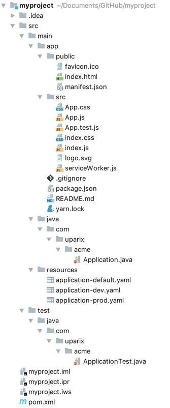

# React with SpringBoot Bundle Maven Archetype

This Maven Archetype creates and builds a react project with a spring boot server backend only using maven build steps.

## Software Stack

- SpringBootFramework 2.1.4.RELEASE
- React 16.8.0
- Node 10.15.3
- Yarn 1.15.2
- frontend-maven-plugin.version 1.7.5
- JUnit5 

## Local Installation

```
  git clone https://github.com/uparix/react-springboot-archetype.git
  
  mvn clean install
```

### Prerequisites

You need Maven installed on your machine.

## Getting Started
```
mvn archetype:generate \
      -DarchetypeGroupId=com.uparix \
      -DarchetypeArtifactId=react-springboot-archetype \
      -DarchetypeVersion=1.0.0 \
      -DgroupId=com.example.acme \
      -DartifactId=myproject \
      -DinteractiveMode=false \
      -Dversion=0.0.1-SNAPSHOT
```

## Usage

```
  mvn clean package spring-boot:run
  
  http://localhost:8080
```

## Project Structure



## Release History
 - 1.0.0
   - Initial Release
 - 1.0.1
   - Updated to recent versions
 - 1.0.2 (06.4.2019)  
   - Updated to recent versions

## Contributing

Please read [CONTRIBUTING.md](https://gist.github.com/PurpleBooth/b24679402957c63ec426) for details on our code of conduct, and the process for submitting pull requests to us.


## Authors

* **Andreas Neuenschwander** - *Initial work* - [Uparix](https://github.com/uparix)
* **Michael Seger** - *Contributions* - [Mike Seger](https://github.com/mike-seger)

## License

This project is licensed under the MIT License - see the [LICENSE.md](LICENSE.md) file for details
